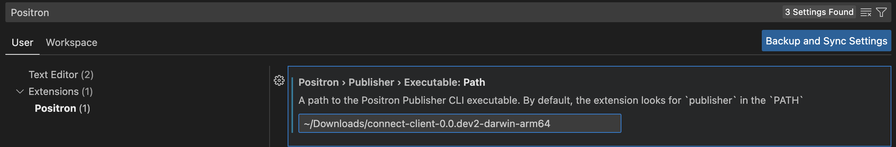

# Posit Publisher

## Quick Start

Download the release executable for your operating system from [GitHub](https://github.com/rstudio/publishing-client/releases).

### Configure the Extension

### Option 1

Configure the `positron.publisher.executable.path` property in your *User* or *Workspace* settings.



### Option 2

Configure your shell with executable on path and alias it to `publisher`.

Here is an example using ZSH on macOS with an M1 Chip (ARM64 architecture).

**~/.zshenv**
```shell
# Replace this with the location of the executable on your machine.
PATHNAME=$HOME/Downloads/connect-client-0.0.dev2-darwin-arm64

export PATH=$PATH:$PATHNAME
alias publisher=$(basename ${PATHNAME})
```
